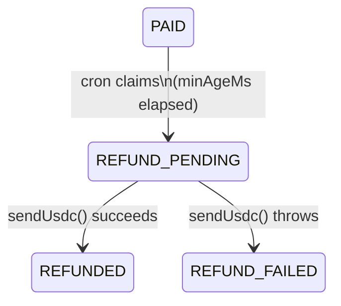

When a buyer pays for a resource, the SDK records the payment in a `ChallengeRecord`. After on-chain verification succeeds, delivery and the `PAID -> DELIVERED` transition happen in the same request.

For **subscription plans**, delivery means `fetchResourceCredentials` succeeds and the `AccessGrant` is returned. For **per-request plans**, delivery means the route handler responds successfully (embedded) or the proxied backend request returns 2xx (standalone).

If delivery fails — for any reason — the record stays in `PAID` state. The refund cron picks it up after a configurable grace period and sends USDC back to the buyer's wallet.

<Note>
  `PAID` is transient in the happy path -- it lasts milliseconds between payment verification and delivery. The refund cron is a **safety net** for failures only.
</Note>

## Refund State Machine



In the full lifecycle, `PAID` is reached via `PENDING -> PAID` after on-chain payment verification. In the happy path, `PAID -> DELIVERED` happens immediately. The refund path only activates when delivery fails.

## Per-Request Refund Path

Pay-per-request plans share the same refund state machine but have different failure triggers:

**Standalone PPR** (seller uses `proxyTo`/`fetchResource`):
- If the backend returns a **non-2xx status**, the challenge stays in `PAID` for refund eligibility. The `ResourceResponse` containing the backend's error body is still returned to the client so it knows what went wrong.
- If `fetchResource` **throws** (e.g. timeout, network error), the challenge stays in `PAID` and the refund cron will process it.
- `DELIVERED` is only set when the backend returns a 2xx response.

**Embedded PPR** (seller uses `key0.payPerRequest()` middleware):
- When a `store` is provided: `markDelivered` is called via `res.on("finish")` (Express/Fastify) or after `await next()` (Hono) when the response status is 2xx. This is **best-effort** — if the process crashes between settlement and `DELIVERED`, the refund cron may refund the payment even though the response was already served. This is a safe fallback: a small risk of over-refunding is preferable to the buyer losing funds.
- When **no `store` is provided**: no `ChallengeRecord` is created. The payment is recorded on-chain but Key0 has no state to track delivery or trigger a refund. If settlement succeeds and your route handler crashes, the buyer cannot be automatically refunded.

<Warning>
  For embedded PPR in production, always pass a `store` to `key0Router` / `key0App` / `key0Plugin`. Without it, settlement failures after on-chain payment are not recoverable via the refund cron.
</Warning>

## Deployment Modes

<Tabs>
  <Tab title="Standalone (Docker)">
    When `KEY0_WALLET_PRIVATE_KEY` is set, the Docker container runs a BullMQ refund cron automatically -- no extra setup needed.

    ```
    ┌──────────────┐   ┌───────────────────────────┐   ┌──────────────────┐
    │ Client Agent │   │    Key0 (Docker)           │   │   Blockchain     │
    │              │   │                            │   │                  │
    │  pays USDC   │──>│  verify on-chain           │──>│                  │
    │              │   │  PENDING ──────────────> PAID  │<─ Transfer event │
    │              │   │                            │   │                  │
    │              │   │  POST ISSUE_TOKEN_API ─────│──>│  500 / timeout   │
    │              │<──│  (token issuance fails)    │   │                  │
    │              │   │  record stays PAID         │   │                  │
    │              │   │                            │   │                  │
    │              │   │  ┌─ BullMQ cron (Redis) ──┐│   │                  │
    │              │   │  │ every REFUND_INTERVAL   ││   │                  │
    │              │   │  │ findPendingForRefund()  ││   │                  │
    │              │   │  │ PAID → REFUND_PENDING   ││   │                  │
    │              │   │  │ sendUsdc() ─────────────┼┼──>│  USDC transfer   │
    │  [refunded]  │   │  │ REFUND_PENDING→REFUNDED ││<──│  txHash          │
    │              │   │  └────────────────────────┘│   │                  │
    └──────────────┘   └───────────────────────────┘   └──────────────────┘
    ```

    **Configuration variables:**

    | Variable | Default | Description |
    |---|---|---|
    | `KEY0_WALLET_PRIVATE_KEY` | -- | Private key of the seller wallet. **Required** to enable refunds. |
    | `REFUND_INTERVAL_MS` | `60000` | How often the cron runs (ms). |
    | `REFUND_MIN_AGE_MS` | `300000` | Grace period before a stuck `PAID` record is eligible (ms). |
    | `REFUND_BATCH_SIZE` | `50` | Max records processed per cron tick. |

    ```bash
    # docker/.env -- add to enable refunds
    KEY0_WALLET_PRIVATE_KEY=0xYourWalletPrivateKeyHere
    REFUND_INTERVAL_MS=60000   # scan every 60s
    REFUND_MIN_AGE_MS=300000   # refund after 5-min grace period
    ```
  </Tab>
  <Tab title="Embedded (SDK)">
    In embedded mode, you wire up `processRefunds` on your own schedule. BullMQ is recommended for multi-instance deployments; `setInterval` works for single-process apps.

    ```
    ┌──────────────┐   ┌──────────────────────────────────────────────────┐   ┌──────────┐
    │ Client Agent │   │                 Your Application                  │   │Blockchain│
    │              │   │  ┌────────────────────────────────────────────┐  │   │          │
    │  pays USDC   │──>│  │  Key0 Middleware                          │  │──>│          │
    │              │   │  │  verify on-chain                          │  │<──│          │
    │              │   │  │  PENDING ─────────────────────────> PAID  │  │   │          │
    │              │   │  │  fetchResourceCredentials() throws        │  │   │          │
    │              │<──│  │  record stays PAID                        │  │   │          │
    │              │   │  └────────────────────────────────────────────┘  │   │          │
    │              │   │                                                   │   │          │
    │              │   │  ┌─ Your refund cron (BullMQ / setInterval) ───┐  │   │          │
    │              │   │  │ processRefunds({ store, walletPrivateKey })  │  │   │          │
    │              │   │  │ PAID → REFUND_PENDING                        │  │   │          │
    │              │   │  │ sendUsdc() ─────────────────────────────────┼──┼──>│ USDC tx  │
    │  [refunded]  │   │  │ REFUND_PENDING → REFUNDED                   │  │<──│ txHash   │
    │              │   │  └─────────────────────────────────────────────┘  │   │          │
    └──────────────┘   └──────────────────────────────────────────────────┘   └──────────┘
    ```

    **BullMQ example:**

    ```typescript
    import { Queue, Worker } from "bullmq";
    import { processRefunds } from "@key0ai/key0";

    // Uses the same `store` passed to key0Router / key0App
    const worker = new Worker("refund-cron", async () => {
      const results = await processRefunds({
        store,
        walletPrivateKey: process.env.KEY0_WALLET_PRIVATE_KEY as `0x${string}`,
        network: "testnet",
        minAgeMs: 5 * 60 * 1000, // 5-min grace period
      });

      for (const r of results) {
        if (r.success) {
          console.log(`Refunded ${r.amount} to ${r.toAddress} tx=${r.refundTxHash}`);
        } else {
          console.error(`Refund failed ${r.challengeId}: ${r.error}`);
        }
      }
    }, { connection: redis });

    const queue = new Queue("refund-cron", { connection: redis });
    await queue.add("process", {}, { repeat: { every: 60_000 } });
    ```

    <Note>
      Your `walletPrivateKey` must correspond to the `walletAddress` that received USDC payments.
      Without Redis, a plain `setInterval` works for single-instance deployments — the atomic
      `PAID -> REFUND_PENDING` compare-and-swap (CAS) transition prevents double-refunds even with overlapping ticks.
    </Note>
  </Tab>
</Tabs>

## `processRefunds()` API Reference

```typescript
import { processRefunds } from "@key0ai/key0";

const results = await processRefunds({
  store,
  walletPrivateKey: "0x...",
  network: "mainnet",
  minAgeMs: 5 * 60 * 1000,
  batchSize: 50,
});
```

### Config

| Option | Type | Default | Description |
|---|---|---|---|
| `store` | `IChallengeStore` | required | Same store instance passed to `createKey0`. |
| `walletPrivateKey` | `` 0x${string} `` | required | Seller wallet private key used to send USDC back. |
| `network` | `"mainnet"` \| `"testnet"` | required | Determines USDC contract address and RPC endpoint. |
| `minAgeMs` | `number` | `300_000` (5 min) | Grace period before a `PAID` record becomes eligible. |
| `batchSize` | `number` | `50` | Max records processed per invocation. |

### Return Value

`processRefunds` returns `RefundResult[]`. Each element is either a success or failure:

```typescript
// Success
{
  challengeId: string;
  originalTxHash: string;
  refundTxHash: string;
  amount: string;
  toAddress: string;
  success: true;
}

// Failure
{
  challengeId: string;
  originalTxHash: string;
  amount: string;
  toAddress: string;
  success: false;
  error: string;
}
```

## Double-Refund Prevention

The `PAID -> REFUND_PENDING` transition is atomic. In Redis, a Lua script implements compare-and-swap:

```lua
local current = redis.call('HGET', KEYS[1], 'state')
if current ~= ARGV[1] then
  return 0  -- state mismatch, another worker claimed it first
end
redis.call('HSET', KEYS[1], 'state', ARGV[2])
-- write any additional field/value pairs
return 1
```

If two cron workers fire at exactly the same time, both read `PAID`. The first Lua call succeeds and returns `1`. The second sees `REFUND_PENDING` (already claimed) and returns `0`, so it skips that record. Only one USDC transfer is ever broadcast.

## `findPendingForRefund`

The cron uses a Redis sorted set `key0:paid` to efficiently find eligible records:

- **On `PENDING -> PAID`:** `ZADD key0:paid <paidAt_ms> <challengeId>`
- **On `PAID -> anything`:** `ZREM key0:paid <challengeId>`

Query:

```
ZRANGEBYSCORE key0:paid 0 <(now - minAgeMs)>
```

This returns all `challengeId` values whose `paidAt` is older than the grace period, in O(log N + M) time.

Each result is fetched from the hash and verified before being returned:
- `state === "PAID"` -- still in refundable state
- `fromAddress` is present -- know where to send USDC
- `accessGrant` is **not** set -- records where token issuance succeeded but the `DELIVERED` transition failed should not be refunded (the buyer already has their credential)

<Warning>
  `REFUND_FAILED` is a **terminal state**. The cron will not pick it up again. See the section below for operator guidance.
</Warning>

## `REFUND_FAILED` Handling

`REFUND_FAILED` is terminal -- `findPendingForRefund` only returns `PAID` records, so failed refunds are never retried automatically.

**Common causes:**
- Seller wallet has insufficient ETH for gas
- RPC endpoint is down or rate-limited
- `sendUsdc` threw an unexpected error

The `refundError` string is written to the `ChallengeRecord`, and the `RefundResult` returned by `processRefunds` has `success: false` with the `error` field set.

**Recommended handling:**

1. Log and alert immediately -- filter results for `!r.success`.
2. Inspect the record via `store.get(challengeId)` -- the `refundError` field contains the raw error message.
3. Fix the underlying cause (top up ETH, restore RPC), then retry manually by transitioning `REFUND_FAILED -> PAID` and letting the cron pick it up on the next tick.

## Timing Diagrams

### A2A Flow

```
t=0:00   requestAccess() called
         store: create PENDING record
         X402Challenge returned to buyer agent

t=?      Buyer pays on-chain, calls submitProof()
         SDK verifies Transfer event, extracts fromAddress
         store: PENDING -> PAID  { txHash, paidAt, fromAddress }
         fetchResourceCredentials() -> JWT issued
         store: PAID -> DELIVERED  { accessGrant, deliveredAt }
         Redis TTL reset from 7 days -> 12 hours
         AccessGrant returned to buyer
         Record deleted after 12 hours
```

### HTTP x402 Flow

```
t=0:00   Client sends AccessRequest without PAYMENT-SIGNATURE
         requestHttpAccess() called
         store: create PENDING record (clientAgentId = "x402-http")
         HTTP 402 returned with payment requirements + challengeId

t=?      Client sends AccessRequest with PAYMENT-SIGNATURE
         Gas wallet / facilitator settles payment on-chain
         processHttpPayment() called with requestId + payer
         store: look up PENDING record via requestId
         store: PENDING -> PAID  { txHash, paidAt, fromAddress (= payer) }
         fetchResourceCredentials() -> JWT issued
         store: PAID -> DELIVERED  { accessGrant, deliveredAt }
         Redis TTL reset from 7 days -> 12 hours
         AccessGrant returned to client
         Record deleted after 12 hours
```

### Refund (Both Paths)

```
         -- if fetchResourceCredentials throws or server crashes between PAID and DELIVERED --

t=5:00   Grace period expires (minAgeMs = 300_000)
         Cron runs processRefunds()
         findPendingForRefund finds the record (still PAID)
         store: PAID -> REFUND_PENDING  (atomic claim)
         sendUsdc(to: fromAddress, amount: amountRaw)
         |-- success:  REFUND_PENDING -> REFUNDED  { refundTxHash, refundedAt }
         |-- failure:  REFUND_PENDING -> REFUND_FAILED  { refundError }
         Record retained for 7 days from createdAt, then deleted
```

## Store TTLs

Records are automatically cleaned up based on their final state via Redis key expiry.

| Key | TTL |
|---|---|
| `key0:challenge:{id}` (hash) | 7 days (set at creation). Shortened to 12 hours on `PAID -> DELIVERED`. |
| `key0:request:{requestId}` (string) | `challengeTTLSeconds` (default 900s / 15 min). |
| `key0:paid` (sorted set) | No expiry. Members are removed on state transition out of `PAID`. |
