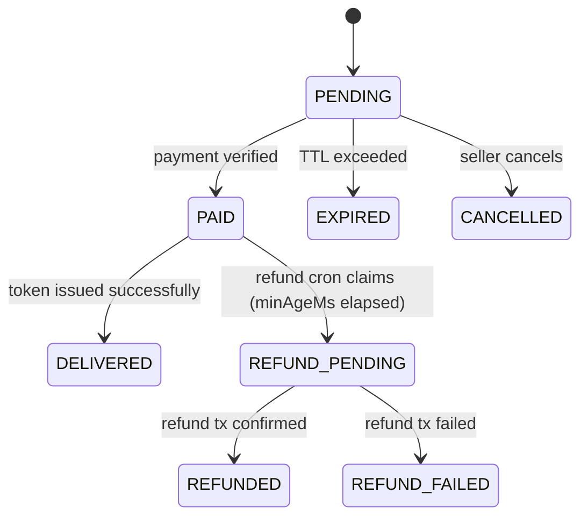

Every payment in Key0 is tracked by a single `ChallengeRecord` that moves through a deterministic state machine. All transitions are atomic -- enforced by a Lua script running inside Redis -- so concurrent requests can never corrupt a record.

## State Diagram



There are two branches from `PAID`:

- **Happy path**: `PAID` transitions to `DELIVERED` within milliseconds -- the SDK issues the access token and marks delivery in the same request.
- **Refund path**: If token issuance fails (e.g., `fetchResourceCredentials` throws or the server crashes), the record stays `PAID`. A refund cron picks it up after a grace period and sends USDC back to the buyer.

<Note>
`DELIVERED` and `REFUNDED` are both terminal success states. `EXPIRED`, `CANCELLED`, and `REFUND_FAILED` are also terminal. Once a record reaches any terminal state, no further transitions are possible.
</Note>

## States

| State | Meaning |
| --- | --- |
| `PENDING` | Awaiting payment |
| `PAID` | Payment verified on-chain, awaiting token issuance and delivery |
| `DELIVERED` | Final success state -- resource served |
| `EXPIRED` | Challenge timed out |
| `CANCELLED` | Manually cancelled |
| `REFUND_PENDING` | Cron claimed record, refund tx being broadcast |
| `REFUNDED` | Refund sent on-chain -- final state |
| `REFUND_FAILED` | Refund tx threw -- needs operator attention |

## Allowed Transitions

| From | To | Trigger | Fields Written |
| --- | --- | --- | --- |
| *(new)* | `PENDING` | `create()` | All base fields |
| `PENDING` | `PAID` | `processHttpPayment()` | `txHash`, `paidAt`, `fromAddress` |
| `PENDING` | `EXPIRED` | Expiry check on access | -- |
| `PENDING` | `CANCELLED` | `cancelChallenge()` | -- |
| `PAID` | `PAID` | Grant persisted (outbox) | `accessGrant` (full JSON) |
| `PAID` | `DELIVERED` | Token issued successfully | `deliveredAt` |
| `PAID` | `PENDING` | `markUsed()` race rollback (extremely rare) | -- |
| `PAID` | `REFUND_PENDING` | Refund cron claims record | -- |
| `REFUND_PENDING` | `REFUNDED` | Refund tx confirmed | `refundTxHash`, `refundedAt` |
| `REFUND_PENDING` | `REFUND_FAILED` | Refund tx failed | `refundError` |

<Note>
The `PAID` to `PAID` self-transition is the **outbox pattern**: the SDK persists the `accessGrant` to the record before returning it to the client, so a failure in the subsequent `DELIVERED` transition does not lose the grant. The refund cron skips records that already have `accessGrant` set.
</Note>

## Per-Request Challenges

Per-request plans create `ChallengeRecord`s and use the same state machine, but with different delivery triggers:

**Standalone PPR** (seller uses `proxyTo`/`fetchResource`):
- `PENDING` is created when `POST /x402/access` receives a `resource` field but no `payment-signature`.
- `PENDING → PAID` transitions immediately after on-chain settlement.
- `PAID → DELIVERED` is triggered when the proxied backend request returns a **2xx** response.
- If the backend returns **non-2xx**, the challenge stays in `PAID` — no `DELIVERED` transition occurs, and the refund cron picks it up.

**Embedded PPR** (seller uses `key0.payPerRequest()` middleware):
- `PENDING` is created when the middleware returns a 402 (no `payment-signature` on the route).
- `PENDING → PAID` transitions immediately when the `payment-signature` is present and settlement succeeds.
- `PAID → DELIVERED` is triggered via `res.on("finish")` (Express/Fastify) or after `await next()` (Hono) when the response status is 2xx.
- When **no `store`** is passed to the middleware: no `ChallengeRecord` is created. State transitions do not occur. The payment is settled on-chain but refunds are not possible.

The `PAID` table note about the outbox pattern (`accessGrant`) does **not** apply to PPR records — per-request challenges do not store an `accessGrant` since no token is issued. The refund cron identifies them by the absence of `accessGrant` and presence of a `resource` field.

## Atomic Transitions -- Lua Script

All state transitions use a single Lua script executed atomically by Redis. If the current state does not match the expected `fromState`, the transition is rejected and no fields are written.

```lua
local current = redis.call('HGET', KEYS[1], 'state')
if current ~= ARGV[1] then
  return 0  -- state mismatch, transition rejected
end
local fromState = ARGV[1]
local toState = ARGV[2]
local challengeId = ARGV[3]
local score = ARGV[4]
redis.call('HSET', KEYS[1], 'state', toState)
for i = 5, #ARGV, 2 do
  redis.call('HSET', KEYS[1], ARGV[i], ARGV[i+1])
end
if toState == 'PAID' and score ~= '' then
  redis.call('ZADD', KEYS[2], score, challengeId)
elseif fromState == 'PAID' then
  redis.call('ZREM', KEYS[2], challengeId)
end
return 1
```

**Script parameters:**

| Parameter | Value |
| --- | --- |
| `KEYS[1]` | `key0:challenge:{challengeId}` -- the challenge hash |
| `KEYS[2]` | `key0:paid` -- the sorted set tracking PAID records |
| `ARGV[1]` | `fromState` -- expected current state |
| `ARGV[2]` | `toState` -- target state |
| `ARGV[3]` | `challengeId` -- used as the sorted set member |
| `ARGV[4]` | `paidAt` epoch ms (or empty string) -- used as the sorted set score |
| `ARGV[5..N]` | Field/value pairs to write to the hash |

**ZADD / ZREM logic:**

- When transitioning **to** `PAID`, the script adds the challenge to the `key0:paid` sorted set with the `paidAt` timestamp as the score. This makes the record visible to the refund cron.
- When transitioning **from** `PAID` (to `DELIVERED`, `REFUND_PENDING`, etc.), the script removes the challenge from the sorted set. This prevents the refund cron from picking up records that have already moved on.

<Note>
The `EXPIRE` call that shortens TTL to 12 hours on `DELIVERED` is done **outside** the Lua script. TTL adjustment is not a correctness invariant -- it is a storage optimization.
</Note>

## Redis Schema

All keys use the prefix `key0` (configurable via `keyPrefix`).

### Challenge Record Hash

**Key**: `key0:challenge:{challengeId}`

Stored as a Redis Hash (`HSET`/`HGETALL`). Each field is a string.

| Hash Field | Type | Set When | Example |
| --- | --- | --- | --- |
| `challengeId` | string | CREATE | `"http-a1b2c3d4-..."` or UUID |
| `requestId` | string | CREATE | `"550e8400-e29b-..."` (client-generated UUID) |
| `clientAgentId` | string | CREATE | `"did:web:agent.example"` or `"x402-http"` |
| `resourceId` | string | CREATE | `"photo-123"` or `"default"` |
| `planId` | string | CREATE | `"basic"` |
| `amount` | string | CREATE | `"$0.10"` |
| `amountRaw` | string (bigint) | CREATE | `"100000"` (USDC 6-decimal micro-units) |
| `asset` | string | CREATE | `"USDC"` |
| `chainId` | string (number) | CREATE | `"84532"` (Base Sepolia) or `"8453"` (Base) |
| `destination` | string (0x) | CREATE | `"0xAbCd..."` (seller wallet) |
| `state` | string | CREATE, updated on transitions | `"PENDING"` / `"PAID"` / `"DELIVERED"` / etc. |
| `expiresAt` | ISO-8601 string | CREATE | `"2025-03-05T12:30:00.000Z"` |
| `createdAt` | ISO-8601 string | CREATE | `"2025-03-05T12:15:00.000Z"` |
| `txHash` | string (0x) | PENDING to PAID | `"0x1234..."` |
| `paidAt` | ISO-8601 string | PENDING to PAID | `"2025-03-05T12:16:00.000Z"` |
| `fromAddress` | string (0x) | PENDING to PAID | `"0xBuyer..."` (payer wallet) |
| `accessGrant` | JSON string | PAID to PAID (outbox) | Full `AccessGrant` object |
| `deliveredAt` | ISO-8601 string | PAID to DELIVERED | `"2025-03-05T12:16:05.000Z"` |
| `refundTxHash` | string (0x) | REFUND_PENDING to REFUNDED | `"0xRefund..."` |
| `refundedAt` | ISO-8601 string | REFUND_PENDING to REFUNDED | `"2025-03-05T12:21:00.000Z"` |
| `refundError` | string | REFUND_PENDING to REFUND_FAILED | `"insufficient gas"` |

### Request Index

**Key**: `key0:request:{requestId}`

A simple `SET` key mapping `requestId` to `challengeId`. Used for idempotency: if the same `requestId` is submitted again, the existing challenge is returned instead of creating a new one.

```
KEY:   key0:request:550e8400-e29b-...
VALUE: http-a1b2c3d4-...
TTL:   900s (challengeTTLSeconds)
```

### Seen Transaction Set

**Key**: `key0:seentx:{txHash}`

A `SET NX` key for double-spend prevention. Maps `txHash` to `challengeId`. The `NX` flag ensures only the first write succeeds -- if a second request tries to claim the same transaction hash, the `SET` returns `false` and the engine rejects it.

```
KEY:   key0:seentx:0x1234abcd...
VALUE: http-a1b2c3d4-...
TTL:   7 days (604,800s)
```

### Paid Set (Sorted Set)

**Key**: `key0:paid`

A Redis Sorted Set tracking `PAID` records for the refund cron. The score is the `paidAt` epoch timestamp in milliseconds, enabling efficient range queries for records older than the grace period.

| Operation | When |
| --- | --- |
| `ZADD` | State transitions to `PAID` (score = `paidAt` epoch ms) |
| `ZREM` | State transitions from `PAID` (to `DELIVERED`, `REFUND_PENDING`, etc.) |
| `ZRANGEBYSCORE 0 <cutoff>` | Refund cron queries records older than `minAgeMs` |

## TTL Management

| Key | Default TTL | Notes |
| --- | --- | --- |
| `key0:challenge:{id}` | 7 days (604,800s) | Set at creation |
| `key0:challenge:{id}` (after DELIVERED) | 12 hours (43,200s) | Shortened on delivery -- storage optimization |
| `key0:request:{requestId}` | 900s (challengeTTLSeconds) | Matches challenge expiry window |
| `key0:seentx:{txHash}` | 7 days (604,800s) | Must outlive the challenge record for double-spend safety |
| `key0:paid` (sorted set) | No expiry | Members are added/removed by the Lua script on transitions |

## Redis Commands Per Operation

| Operation | Redis Commands |
| --- | --- |
| **create** | Pipeline: `EXISTS` (guard) + `HSET` (challenge hash) + `EXPIRE` (7d) + `SET EX` (request index, 900s) |
| **get** | `HGETALL` |
| **findActiveByRequestId** | `GET` (request index) then `HGETALL` (challenge hash) |
| **transition** | `EVAL` (Lua: check state + `HSET` + conditional `ZADD`/`ZREM`) + conditional `EXPIRE` (if DELIVERED) |
| **markUsed** | `SET NX EX` (7d) |
| **findPendingForRefund** | `ZRANGEBYSCORE` then N x (`HGETALL` + conditional `ZREM` for ghost entries) |
| **healthCheck** | `PING` |
