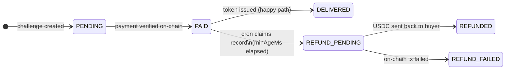

A seller that **intentionally fails** during token issuance so you can observe the full refund lifecycle: a BullMQ cron job detects stuck payments and sends USDC back to the buyer on-chain.

This example is a testing and development tool. It proves that your refund infrastructure works end-to-end before you deploy to production.

## What It Demonstrates

In the happy path, `fetchResourceCredentials` issues a JWT and the challenge transitions from `PAID` to `DELIVERED` in the same request. But if that callback throws -- or the server crashes mid-delivery -- the challenge gets stuck in `PAID` state. The buyer has paid, but received nothing.

The refund cron is the safety net. It periodically scans for `PAID` records older than a grace period and refunds the USDC on-chain.



<Info>
  In this example, **every payment** triggers a refund because `fetchResourceCredentials` always throws. In production, refunds only happen when delivery genuinely fails.
</Info>

## Code Walkthrough

### The intentional failure

The seller is configured with a `fetchResourceCredentials` callback that always throws. This simulates a downstream failure -- a database outage, a rate limit, a misconfigured token issuer -- anything that prevents credential delivery after payment:

```typescript
fetchResourceCredentials: async (params) => {
  console.log("New token issued", params);
  throw new Error("No Token Issued"); // Intentional failure for testing
},
```

Because this callback throws, the challenge engine catches the error and leaves the record in `PAID` state instead of transitioning it to `DELIVERED`.

### Redis storage

Both the challenge store and the seen-tx store share a single Redis connection. The challenge store tracks the full state machine; the seen-tx store prevents double-spend of the same transaction hash:

```typescript
const redis = new Redis(REDIS_URL, { maxRetriesPerRequest: null });
const store = new RedisChallengeStore({ redis, challengeTTLSeconds: 900 });
const seenTxStore = new RedisSeenTxStore({ redis });
```

### BullMQ cron setup

The refund cron uses BullMQ's repeatable job feature. On startup, it clears any stale repeatable jobs from a previous run, registers a new one at the configured interval, then starts a worker:

```typescript
const refundQueue = new Queue("refund-cron", { connection: makeBullConnection() });

// Clean up stale repeatables from previous runs
const repeatables = await refundQueue.getRepeatableJobs();
for (const job of repeatables) {
  await refundQueue.removeRepeatableByKey(job.key);
}

// Register the repeatable job
await refundQueue.add("process-refunds", {}, { repeat: { every: REFUND_INTERVAL_MS } });
await refundQueue.close();

// Start the worker that executes the cron
const cronWorker = new Worker("refund-cron", () => runRefundCron(), {
  connection: makeBullConnection(),
});
```

<Note>
  The queue is closed after registration because only the **Worker** needs an active connection. BullMQ stores the repeat schedule in Redis, so the worker picks it up independently.
</Note>

### The refund function

Each cron tick calls `processRefunds()` from the SDK. This function handles the entire refund lifecycle atomically:

```typescript
async function runRefundCron(): Promise<void> {
  if (!WALLET_PRIVATE_KEY) {
    console.log("[Cron] Skipped — KEY0_WALLET_PRIVATE_KEY not set.");
    return;
  }

  const results = await processRefunds({
    store,
    walletPrivateKey: WALLET_PRIVATE_KEY,
    network: NETWORK,
    minAgeMs: REFUND_MIN_AGE_MS,
  });

  if (results.length === 0) {
    console.log("[Cron] No eligible records.");
    return;
  }

  for (const result of results) {
    if (result.success) {
      console.log(`[Cron] REFUNDED  ${result.amount} → ${result.toAddress}  tx=${result.refundTxHash}`);
    } else {
      console.error(`[Cron] REFUND_FAILED  challengeId=${result.challengeId}  error=${result.error}`);
    }
  }
}
```

Under the hood, `processRefunds()` does four things:

1. Queries the store for challenges in `PAID` state older than `minAgeMs`
2. Atomically transitions each to `REFUND_PENDING` (prevents duplicate refunds across replicas)
3. Sends USDC back to the buyer's wallet on-chain
4. Transitions to `REFUNDED` on success, or `REFUND_FAILED` if the on-chain transaction reverts

<Warning>
  The `KEY0_WALLET_PRIVATE_KEY` environment variable is required for refunds. This is the private key of the **seller's wallet** -- the same wallet that received the original payment. Without it, the cron runs but skips all refund processing.
</Warning>

## Running the Example

### Prerequisites

- Redis running locally (or a remote instance)
- A wallet address and its private key (the seller wallet)
- Bun installed

### Setup

<Steps>
  <Step title="Navigate to the example">
    ```bash
    cd examples/refund-cron-example
    ```
  </Step>
  <Step title="Configure environment variables">
    ```bash
    cp .env.example .env
    ```

    Set the following in `.env`:

    | Variable | Required | Default | Description |
    | --- | --- | --- | --- |
    | `KEY0_WALLET_ADDRESS` | Yes | -- | Seller wallet address (receives payments) |
    | `KEY0_WALLET_PRIVATE_KEY` | Yes | -- | Seller wallet private key (signs refund transactions) |
    | `KEY0_ACCESS_TOKEN_SECRET` | Yes | -- | Secret for JWT signing (min 32 characters) |
    | `KEY0_NETWORK` | No | `testnet` | `testnet` (Base Sepolia) or `mainnet` (Base) |
    | `REDIS_URL` | No | `redis://localhost:6379` | Redis connection URL |
    | `PORT` | No | `3000` | HTTP server port |
    | `PUBLIC_URL` | No | `http://localhost:3000` | Public URL for agent card and resource endpoints |
    | `REFUND_INTERVAL_MS` | No | `15000` | How often the cron checks for stuck payments (ms) |
    | `REFUND_MIN_AGE_MS` | No | `30000` | Grace period before a `PAID` record is eligible for refund (ms) |
  </Step>
  <Step title="Install dependencies">
    ```bash
    bun install
    ```
  </Step>
  <Step title="Start the server">
    ```bash
    bun run start
    ```
  </Step>
</Steps>

### Expected Output

On startup, the server prints its configuration:

```
Refund Cron Demo — http://localhost:3000
  Network : testnet
  Wallet  : 0xYour...Address
  Redis   : redis://localhost:6379

Refund cron:
  Interval     : 15s
  Grace period : 30s
  Status       : ACTIVE
```

While idle, the cron logs each tick:

```
[Cron] No eligible records.
[Cron] No eligible records.
```

After a client agent pays for a resource, `fetchResourceCredentials` throws and the payment gets stuck. Once the grace period elapses, the next cron tick picks it up:

```
[Payment] Received payment for photo-001
  TX: https://sepolia.basescan.org/tx/0xabc...
New token issued { requestId: '...', challengeId: '...', planId: 'single', ... }
[Cron] REFUNDED  0.10 → 0xBuyer...Address  tx=0xdef...
--------------------------------
```

The buyer's USDC is returned on-chain. The challenge record is now in `REFUNDED` state and will not be processed again.

### Testing the full cycle

To trigger a payment and observe the refund, run an agent against this seller. The agent will pay, the seller will fail to deliver, and within 30 seconds the cron will refund the payment.

<CardGroup cols={2}>
  <Card title="Refunds reference" icon="rotate-left" href="/architecture/refunds">
    How the refund state machine, grace periods, and double-refund prevention work in production.
  </Card>
  <Card title="Source code" icon="github" href="https://github.com/key0ai/key0/tree/main/examples/refund-cron-example">
    `examples/refund-cron-example/server.ts`
  </Card>
</CardGroup>
