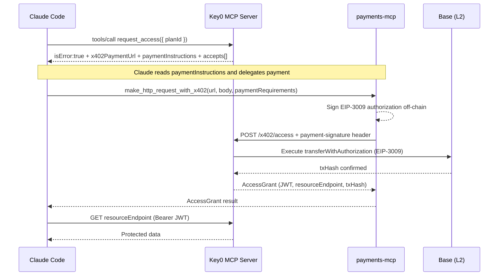

Connect Claude Code to any Key0-powered service in two steps: add the seller's MCP server and set up a payment wallet.

## What You Need

- [Claude Code](https://docs.anthropic.com/en/docs/claude-code) installed
- The seller's URL (e.g. `https://my-service.example.com`)
- A funded wallet with USDC on Base (testnet or mainnet)

<Note>
  For testnet, get free USDC from [faucet.circle.com](https://faucet.circle.com).
</Note>

## Step 1: Install Payments MCP

[`@coinbase/payments-mcp`](https://github.com/coinbase/payments-mcp) handles wallet signing and on-chain settlement. Install it with the interactive setup:

```bash
npx @coinbase/payments-mcp
```

The installer walks you through:
1. Select **Claude Code** as your MCP client
2. Choose automatic or manual configuration
3. Complete the wallet login flow

Once installed, files are saved to `~/.payments-mcp/` and the server is registered in your MCP config automatically.

<Info>
  See the [Coinbase Payments MCP docs](https://docs.cdp.coinbase.com/payments-mcp/welcome) for detailed wallet setup and authentication.
</Info>

## Step 2: Add the Key0 Seller

Add the seller's MCP server to your `.mcp.json` (project root) or use the CLI:

<Tabs>
  <Tab title=".mcp.json">
    ```json .mcp.json
    {
      "mcpServers": {
        "my-service": {
          "type": "http",
          "url": "https://my-service.example.com/mcp"
        }
      }
    }
    ```
  </Tab>
  <Tab title="CLI">
    ```bash
    claude mcp add my-service --transport http --url https://my-service.example.com/mcp
    ```
  </Tab>
</Tabs>

### Finding the MCP URL

If the seller has MCP enabled, the URL is their base URL + `/mcp`:

```
https://my-service.example.com/mcp
```

Verify by checking the discovery endpoint:

```bash
curl https://my-service.example.com/.well-known/mcp.json
```

## How It Works

Once configured, just ask Claude to use the service. Claude handles the payment flow automatically:

```
You: "Get me the latest satellite photo of Tokyo"
```

Claude will:

1. Call `discover_plans` — see available plans and pricing
2. Call `request_access` — get a payment challenge (Key0 returns a PaymentRequired response)
3. Use `payments-mcp` (`make_http_request_with_x402`) to sign and submit the USDC payment
4. Receive an access token (JWT) in the `AccessGrant`
5. Call the protected API with the Bearer token

All of this happens in a single conversation turn.

---

## How payments-mcp works under the hood

This section explains what happens between step 2 and step 4 — the part that's invisible from the CLI.

### Sequence diagram



### What Key0 returns when payment is missing

When an agent calls `request_access` without a payment, Key0's MCP integration returns:

```json
{
  "isError": true,
  "structuredContent": {
    "x402Version": 2,
    "error": "Payment required to access this resource",
    "resource": {
      "url": "https://my-service.example.com/x402/access",
      "description": "Basic plan",
      "mimeType": "application/json"
    },
    "accepts": [
      {
        "scheme": "exact",
        "network": "eip155:8453",
        "asset": "0x833589fCD6eDb6E08f4c7C32D4f71b54bdA02913",
        "amount": "1000000",
        "payTo": "0xSellerWallet...",
        "maxTimeoutSeconds": 900,
        "extra": { "name": "USDC", "version": "2", "planId": "basic" }
      }
    ]
  },
  "content": [
    {
      "type": "text",
      "text": "{ \"x402PaymentUrl\": \"https://my-service.example.com/x402/access\", \"paymentInstructions\": \"To complete payment, use make_http_request_with_x402 with: URL=..., method=POST, body={...}, and pass the accepts array as paymentRequirements.\" }"
    }
  ]
}
```

Key fields the LLM reads:
- `structuredContent.accepts[]` — the `paymentRequirements` array to pass to `make_http_request_with_x402`
- `content[0].text` — contains `x402PaymentUrl` and human-readable `paymentInstructions` so the LLM can understand the next action even without structured content support

### What payments-mcp does

The `make_http_request_with_x402` tool from `@coinbase/payments-mcp`:
1. Receives the `x402PaymentUrl`, the request body, and the `paymentRequirements` (accepts array)
2. Signs an EIP-3009 `transferWithAuthorization` off-chain using the configured CDP (Coinbase Developer Platform) wallet
3. Base64-encodes the signed payload into the `payment-signature` header
4. POSTs to `/x402/access` with the header attached
5. Key0 settles the on-chain transfer via the gas wallet or facilitator
6. Returns the `AccessGrant` JSON to Claude

<Note>
  The buyer (Claude Code) never pays gas. The EIP-3009 authorization delegates the on-chain execution to Key0's gas wallet, which covers all gas fees.
</Note>

---

## Try It Locally

<Steps>
  <Step title="Start a Key0 seller">
    ```bash
    cd examples/express-seller
    bun install && bun run start
    ```

    The server starts at `http://localhost:3000` with MCP enabled.
  </Step>
  <Step title="Set up payments-mcp">
    ```bash
    npx @coinbase/payments-mcp
    ```

    Follow the interactive setup and complete the wallet login.
  </Step>
  <Step title="Add the local seller">
    ```bash
    claude mcp add local-seller --transport http --url http://localhost:3000/mcp
    ```
  </Step>
  <Step title="Fund your wallet">
    Get Base Sepolia USDC from [faucet.circle.com](https://faucet.circle.com) for your wallet address.
  </Step>
  <Step title="Use Claude Code">
    Open Claude Code in the same directory. Ask it to interact with the seller — it discovers the plans, pays, and accesses the API.
  </Step>
</Steps>

---

## Troubleshooting

<AccordionGroup>
  <Accordion title="payments-mcp says 'wallet not funded'">
    Your CDP wallet does not have sufficient USDC. Check the network — if the seller is on Base Sepolia, your wallet needs **Base Sepolia USDC** (not mainnet). Get free testnet USDC from [faucet.circle.com](https://faucet.circle.com).
  </Accordion>
  <Accordion title="Request fails with 'wrong network'">
    The seller is on a different chain than your wallet. Check `GET /discover` to see the seller's `network` field (e.g., `eip155:84532` = Base Sepolia, `eip155:8453` = Base mainnet). Ensure your payments-mcp wallet is configured for the same network.
  </Accordion>
  <Accordion title="Claude cannot find the 'discover_plans' tool">
    The seller may not have MCP enabled. Verify by calling `GET https://my-service.example.com/.well-known/mcp.json`. If you get a 404, the seller only supports x402 HTTP — use the [Paying for Access](/guides/paying-for-access) guide instead with a custom script.
  </Accordion>
  <Accordion title="payments-mcp is not installed or not in .mcp.json">
    Run `npx @coinbase/payments-mcp` again to reinstall and re-register. Check `~/.mcp.json` (global) or `.mcp.json` (project) to confirm the `payments-mcp` entry is present.
  </Accordion>
  <Accordion title="CHALLENGE_EXPIRED error">
    The payment window (default 15 minutes) elapsed between the challenge being issued and the payment arriving. Ask Claude to retry — it will get a fresh challenge.
  </Accordion>
</AccordionGroup>

---

## Next Steps

<CardGroup cols={2}>
  <Card title="Paying for Access" icon="credit-card" href="/guides/paying-for-access">
    Build a custom client: full EIP-3009 example with TypeScript and viem.
  </Card>
  <Card title="MCP Protocol Details" icon="plug" href="/protocol/mcp">
    Full reference for the Key0 MCP tools, payment paths, and stateless architecture.
  </Card>
  <Card title="Building a Seller" icon="rocket" href="/guides/building-a-seller">
    Set up your own Key0-powered service that Claude Code can connect to.
  </Card>
</CardGroup>
