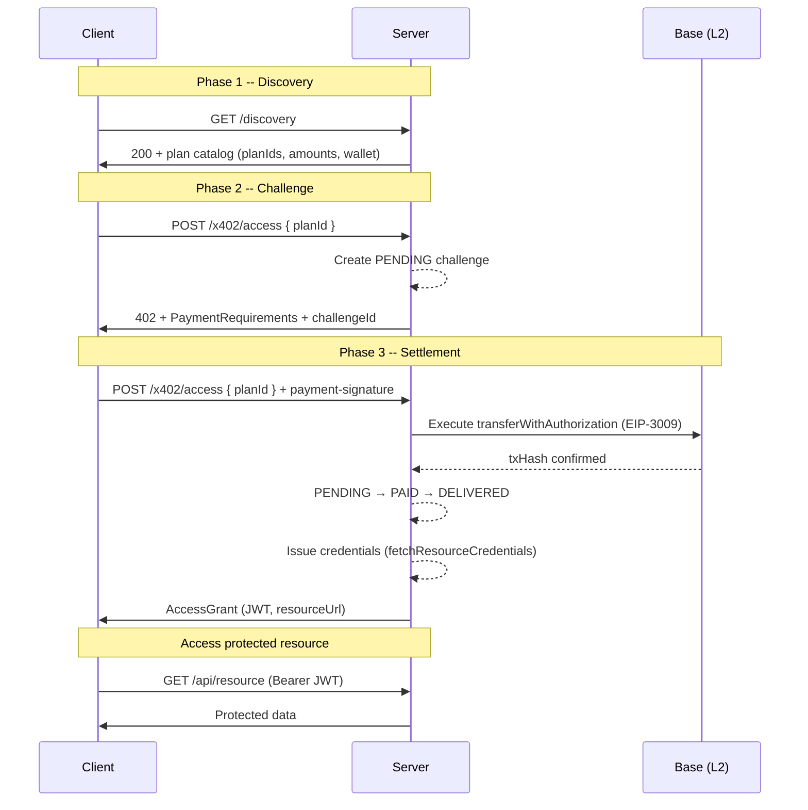

<Note>
  Unfamiliar with terms like EIP-3009, x402, AccessGrant, or ChallengeEngine? Read [Core Concepts](/introduction/core-concepts) first.
</Note>

Key0 uses a **three-phase payment flow** to gate API access behind on-chain USDC payments on Base. Every transaction follows the same pattern regardless of transport.

<Steps>
  <Step title="Discover Plans">
    The client calls `GET /discovery` to browse available plans and pricing. This returns all plan IDs, USDC amounts, and the seller's wallet address. No payment or challenge is created.
  </Step>
  <Step title="Request Access and Pay">
    The client sends `POST /x402/access` with a `planId`. The server creates a PENDING challenge and returns a 402 with the payment amount, destination wallet, and chain ID. The client signs an EIP-3009 authorization off-chain and retries with a `payment-signature` header. The server settles on-chain.
  </Step>
  <Step title="Access the Resource">
    The server returns an `AccessGrant` containing a JWT and the resource endpoint. The client uses the JWT as a Bearer token to call the protected API.
  </Step>
</Steps>

## Sequence Diagram

## Phase 1 -- Discovery

The client calls `GET /discovery` to retrieve the full plan catalog. The response contains one entry per configured plan with its `planId`, USDC amount, seller wallet, and chain ID. No challenge record is created.

<Note>
  `POST /x402/access` without a `planId` returns HTTP **400** with a pointer to `GET /discovery` — it is not the discovery endpoint.
</Note>

## Phase 2 -- Challenge

The client sends `POST /x402/access` with a `resourceId` and `planId`. The server looks up the matching plan, creates a **PENDING** challenge record in the challenge store, and returns a 402 containing:

- **amount** -- the USDC amount to pay (in base units)
- **destination** -- the seller's wallet address
- **chainId** -- `8453` (Base mainnet) or `84532` (Base Sepolia)
- **challengeId** -- a unique identifier for this payment session

## Phase 3 -- Settlement and Grant

The client signs an EIP-3009 authorization off-chain and retries `POST /x402/access` with the same `planId` + `requestId` plus a `payment-signature` header. The server then:

1. Verifies the ERC-20 `Transfer` event on Base matches the expected amount, destination, and chain.
2. Transitions the challenge from **PENDING** to **PAID** (atomic, prevents double-spend).
3. Calls the seller's `fetchResourceCredentials` callback to issue a credential (JWT, API key, or any token).
4. Transitions from **PAID** to **DELIVERED** and returns an `AccessGrant` with the token and resource URL.

All state transitions go through `ChallengeEngine`, which enforces the state machine invariants and logs every transition for auditability.

## Two Endpoints, One Engine

Both entry points share the same `ChallengeEngine` instance, so payment logic, state management, and security invariants are identical regardless of how the client connects.

| Endpoint | Use Case |
|---|---|
| `POST /x402/access` | Unified: x402 HTTP flow (default) or A2A JSON-RPC (with `X-A2A-Extensions` header, Express only) |
| `POST /mcp` | MCP Streamable HTTP (opt-in via `mcp: true`) |

## Next Steps

<CardGroup cols={2}>
  <Card title="Paying for Access" icon="credit-card" href="/guides/paying-for-access">
    The buyer's perspective: sign EIP-3009, submit payment, and use the access token.
  </Card>
  <Card title="Payment Flow Details" icon="diagram-project" href="/architecture/payment-flow">
    Full walkthrough of every state transition and error path.
  </Card>
  <Card title="State Machine" icon="arrows-spin" href="/architecture/state-machine">
    The complete PENDING / PAID / DELIVERED / EXPIRED / REFUNDED state diagram.
  </Card>
  <Card title="Settlement Strategies" icon="link" href="/architecture/settlement-strategies">
    Direct transfer vs. EIP-3009 authorization and facilitator settlement.
  </Card>
</CardGroup>
