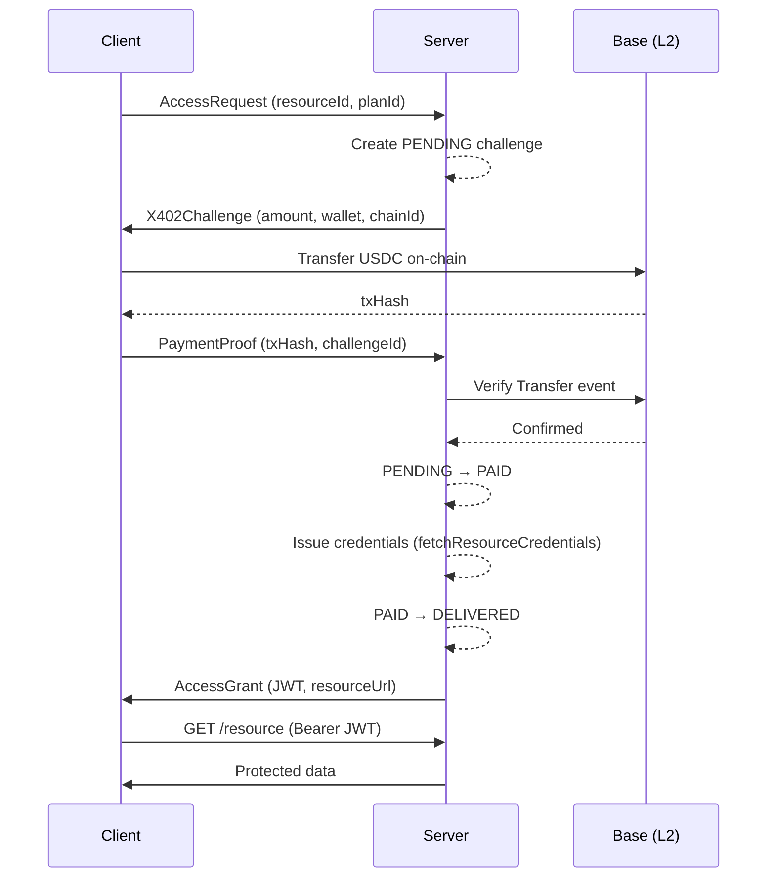

Key0 uses a **two-phase payment flow** to gate API access behind on-chain USDC payments on Base. Every transaction follows the same pattern regardless of transport.

<Steps>
  <Step title="Request Access">
    The client sends an `AccessRequest` specifying a `resourceId` and `planId`. The server creates a payment challenge and returns the amount, destination wallet, and chain ID.
  </Step>
  <Step title="Pay and Prove">
    The client pays USDC on Base (on-chain transfer or EIP-3009 authorization). It then submits the transaction hash as proof. The server verifies the transfer on-chain and issues credentials.
  </Step>
  <Step title="Access the Resource">
    The server returns an `AccessGrant` containing a JWT and the resource endpoint. The client uses the JWT as a Bearer token to call the protected API.
  </Step>
</Steps>

## Sequence Diagram

## Phase 1 -- Challenge

The client sends an `AccessRequest` with a `resourceId` and `planId`. The server looks up the matching plan, creates a **PENDING** challenge record in the challenge store, and returns an `X402Challenge` containing:

- **amount** -- the USDC amount to pay (in base units)
- **destination** -- the seller's wallet address
- **chainId** -- `8453` (Base mainnet) or `84532` (Base Sepolia)
- **challengeId** -- a unique identifier for this payment session

## Phase 2 -- Settlement and Grant

Once the client has paid on-chain, it submits a `PaymentProof` with the `txHash` and `challengeId`. The server then:

1. Verifies the ERC-20 `Transfer` event on Base matches the expected amount, destination, and chain.
2. Transitions the challenge from **PENDING** to **PAID** (atomic, prevents double-spend).
3. Calls the seller's `fetchResourceCredentials` callback to issue a credential (JWT, API key, or any token).
4. Transitions from **PAID** to **DELIVERED** and returns an `AccessGrant` with the token and resource URL.

All state transitions go through `ChallengeEngine`, which enforces the state machine invariants and logs every transition for auditability.

## Three Transports, One Engine

Every transport shares the same `ChallengeEngine` instance, so payment logic, state management, and security invariants are identical regardless of how the client connects.

| Transport | Endpoint | Use Case |
|---|---|---|
| **REST (x402)** | `/x402/access` | Simple HTTP 402 payment flow |
| **A2A JSON-RPC** | `{basePath}/jsonrpc` | Agent-to-agent protocol with x402 middleware |
| **A2A Executor** | Native A2A via `@a2a-js/sdk` | Full A2A protocol integration |

## Next Steps

<CardGroup cols={2}>
  <Card title="Payment Flow Details" icon="diagram-project" href="/architecture/payment-flow">
    Full walkthrough of every state transition and error path.
  </Card>
  <Card title="State Machine" icon="arrows-spin" href="/architecture/state-machine">
    The complete PENDING / PAID / DELIVERED / EXPIRED / REFUNDED state diagram.
  </Card>
  <Card title="Settlement Strategies" icon="link" href="/architecture/settlement-strategies">
    Direct transfer vs. EIP-3009 authorization and facilitator settlement.
  </Card>
  <Card title="Two Modes" icon="toggle-on" href="/introduction/two-modes">
    Embedded SDK vs. standalone Docker service.
  </Card>
</CardGroup>
