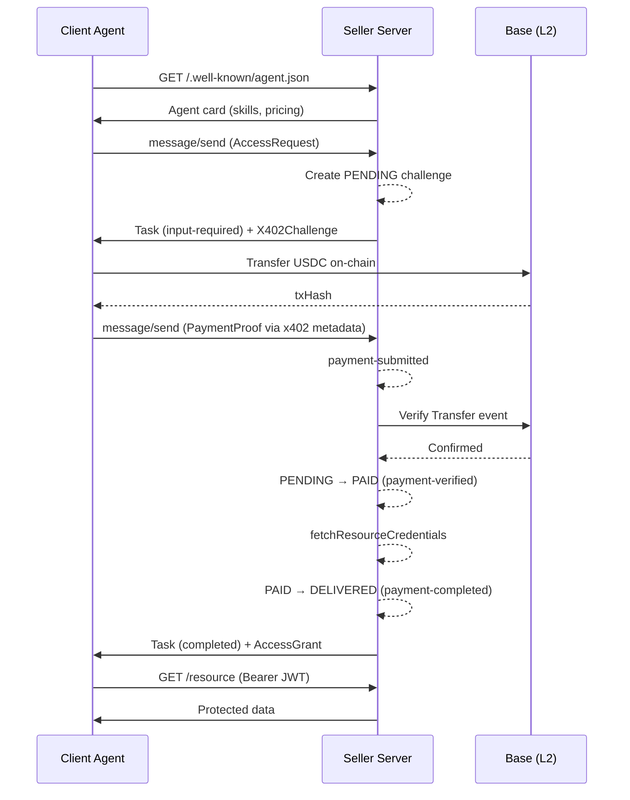

The A2A (Agent-to-Agent) flow follows [Google's A2A protocol](https://google.github.io/A2A/). Client agents discover the seller via the agent card, negotiate payment via the A2A task lifecycle, and access protected resources with the issued JWT.

All A2A interactions use the same `ChallengeEngine` and state machine as the x402 HTTP flow. The difference is the wire format: A2A task lifecycle with x402 metadata keys instead of HTTP headers. A2A-native clients reach the `Key0Executor` via `POST /x402/access` with the `X-A2A-Extensions` header (Express only).

## Flow Overview

<Steps>
  <Step title="Discovery">
    The client fetches `/.well-known/agent.json` to learn about available skills, pricing plans, and the seller's wallet address.
  </Step>
  <Step title="Access Request">
    The client sends an `AccessRequest` with a `resourceId` and `planId` via A2A `message/send`.
  </Step>
  <Step title="Challenge">
    The server creates a **PENDING** record in the challenge store and returns an `X402Challenge` with the payment amount, destination wallet, chain ID, and expiration.
  </Step>
  <Step title="Payment">
    The client pays on-chain USDC on Base -- a standard ERC-20 transfer. No custom contracts or off-chain signatures required.
  </Step>
  <Step title="Proof">
    The client submits a `PaymentProof` containing the transaction hash via a second `message/send` with x402 payment metadata.
  </Step>
  <Step title="Verification">
    The server verifies the payment on-chain: correct recipient, correct amount, not expired, not double-spent. On success, the challenge transitions from **PENDING** to **PAID**.
  </Step>
  <Step title="Grant">
    The server calls `fetchResourceCredentials` to issue a credential (JWT, API key, etc.), transitions **PAID** to **DELIVERED**, and returns an `AccessGrant` with the token and resource endpoint URL.
  </Step>
  <Step title="Access">
    The client uses the token as a `Bearer` header to call the protected resource directly.
  </Step>
</Steps>

## Sequence Diagram



## A2A Protocol Details

The A2A flow uses `Key0Executor`, which implements the `AgentExecutor` interface from `@a2a-js/sdk`. The payment negotiation happens across two `message/send` round-trips, using task metadata to carry x402 payment state.

### Phase 1 -- AccessRequest to Challenge

The client sends a `message/send` JSON-RPC request with an `AccessRequest` in the message parts:

```json
{
  "jsonrpc": "2.0",
  "method": "message/send",
  "id": "1",
  "params": {
    "message": {
      "parts": [
        {
          "kind": "data",
          "data": {
            "type": "AccessRequest",
            "planId": "basic",
            "requestId": "550e8400-e29b-41d4-a716-446655440000",
            "resourceId": "photo-123",
            "clientAgentId": "did:web:buyer.example"
          }
        }
      ]
    }
  }
}
```

The executor calls `engine.requestAccess()` and publishes a Task with:

- **State**: `input-required` -- indicating the client needs to take action (pay)
- **Metadata**: `x402.payment.status` set to `"payment-required"` and `x402.payment.required` containing the full `PaymentRequirements` object
- **Parts**: a text description of the challenge plus the `X402Challenge` as a data part

### Phase 2 -- Payment to Grant

After paying on-chain, the client sends a second `message/send` with the payment payload in task metadata:

```json
{
  "jsonrpc": "2.0",
  "method": "message/send",
  "id": "2",
  "params": {
    "message": {
      "metadata": {
        "x402.payment.status": "payment-submitted",
        "x402.payment.payload": {
          "x402Version": 2,
          "payload": {
            "signature": "0xSignedEIP3009..."
          },
          "accepted": {
            "extra": {
              "challengeId": "a1b2c3d4-..."
            },
            "scheme": "exact",
            "network": "eip155:84532",
            "asset": "0x036CbD53842c5426634e7929541eC2318f3dCF7e",
            "amount": "100000",
            "payTo": "0xSellerWallet..."
          }
        }
      },
      "parts": [
        { "kind": "text", "text": "Payment submitted" }
      ]
    }
  }
}
```

The executor processes through intermediate working states before returning the final result:

1. Extracts `challengeId` from `payload.accepted.extra.challengeId`
2. Publishes working Task with `x402.payment.status: "payment-submitted"`
3. Calls `settlePayment()` to verify and settle on-chain
4. Publishes working Task with `x402.payment.status: "payment-verified"`
5. Calls `engine.processHttpPayment()` to transition PENDING to PAID to DELIVERED
6. Publishes final Task:
   - **State**: `completed`
   - **Metadata**: `x402.payment.status: "payment-completed"` and `x402.payment.receipts` with the settlement receipt
   - **Parts**: confirmation text and the `AccessGrant` data part
   - **Artifacts**: the `AccessGrant` as a data artifact

## x402 Metadata Keys

All payment state is communicated through task metadata using these keys:

| Key | Value | Direction |
|---|---|---|
| `x402.payment.status` | `payment-required` / `payment-submitted` / `payment-verified` / `payment-completed` / `payment-failed` | Server to Client |
| `x402.payment.required` | `PaymentRequirements` object (plans, wallet, chain) | Server to Client |
| `x402.payment.payload` | `X402PaymentPayload` object (signature, authorization) | Client to Server |
| `x402.payment.receipts` | Array of `X402SettleResponse` (txHash, status) | Server to Client |
| `x402.payment.error` | Error code string (e.g. `CHALLENGE_EXPIRED`) | Server to Client |

## A2A Headers

Native A2A clients send the `X-A2A-Extensions` header on `POST /x402/access`. This tells the Express integration to bypass the standard x402 HTTP flow and route the request to the A2A JSON-RPC handler and `Key0Executor`.

## Next Steps

<CardGroup cols={2}>
  <Card title="x402 HTTP Flow" icon="globe" href="/protocol/x402-http-flow">
    The simpler REST-based payment flow using HTTP 402 status codes.
  </Card>
  <Card title="State Machine" icon="arrows-spin" href="/architecture/state-machine">
    Full state diagram covering PENDING, PAID, DELIVERED, EXPIRED, and REFUNDED states.
  </Card>
  <Card title="Settlement Strategies" icon="link" href="/architecture/settlement-strategies">
    Gas wallet vs. facilitator settlement and EIP-3009 authorization.
  </Card>
  <Card title="Refunds" icon="rotate-left" href="/architecture/refunds">
    Automatic refund handling for failed deliveries.
  </Card>
</CardGroup>
