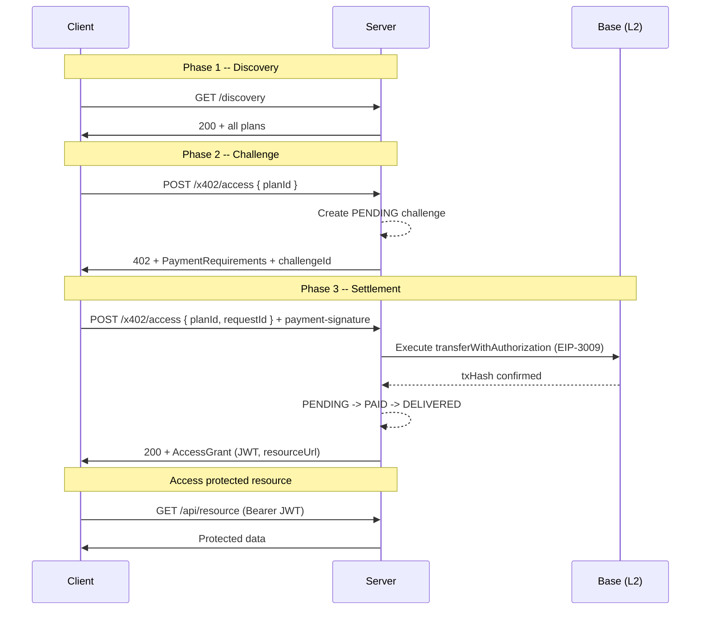

The x402 HTTP flow is the simplest way to interact with Key0. Plan discovery uses `GET /discovery`, and the `POST /x402/access` endpoint handles challenge and settlement:

1. **Discovery** -- `GET /discovery` returns all available plans (HTTP 200). `POST /x402/access` without `planId` returns HTTP 400.
2. **Challenge** -- `planId` present, no `payment-signature` header, creates a PENDING record.
3. **Settlement** -- `planId` present with a `payment-signature` header, settles on-chain and returns an `AccessGrant`.

## Sequence Diagram



## Three Cases

<Tabs>
  <Tab title="Case 1: Discovery">
    Use `GET /discovery` to browse all available plans. No PENDING record is created -- this is a pure pricing query.

    Note: `POST /x402/access` without `planId` returns HTTP 400 with a pointer to this endpoint.

    ### Request

    ```bash
    curl https://api.example.com/discovery
    ```

    ### Response

    ```http
    HTTP/1.1 200 OK
    Content-Type: application/json
    ```

    ```json
    {
      "discoveryResponse": {
        "x402Version": 2,
        "accepts": [
          {
            "scheme": "exact",
            "network": "eip155:84532",
            "asset": "0x036CbD53842c5426634e7929541eC2318f3dCF7e",
            "amount": "100000",
            "payTo": "0xSellerWallet...",
            "maxTimeoutSeconds": 900,
            "extra": {
              "name": "USDC",
              "version": "2",
              "planId": "basic",
              "description": "Basic plan - $0.10 USDC"
            }
          }
        ]
      }
    }
    ```

    The `accepts` array contains one entry per plan configured in `SellerConfig.plans`. Each entry includes the USDC contract address, the amount in base units (6 decimals), and the seller's wallet address.
  </Tab>

  <Tab title="Case 2: Challenge">
    Send a `planId` (and optionally `requestId` and `resourceId`) without a `payment-signature` header. The server creates a PENDING challenge record via `engine.requestHttpAccess()` and returns payment requirements for that specific plan.

    <Note>
      If you omit `requestId`, the server auto-generates one in `http-{uuid}` format. You can provide your own UUID for idempotent retries -- sending the same `requestId` again returns the existing challenge instead of creating a new one.
    </Note>

    ### Request

    ```bash
    curl -X POST https://api.example.com/x402/access \
      -H "Content-Type: application/json" \
      -d '{
        "planId": "basic",
        "requestId": "550e8400-e29b-41d4-a716-446655440000",
        "resourceId": "photo-123"
      }'
    ```

    ### Response

    ```http
    HTTP/1.1 402 Payment Required
    payment-required: eyJ4NDAyVm... (base64-encoded JSON)
    www-authenticate: Payment realm="https://api.example.com", accept="exact", challenge="http-a1b2c3d4-..."
    Content-Type: application/json
    ```

    ```json
    {
      "x402Version": 2,
      "accepts": [
        {
          "scheme": "exact",
          "network": "eip155:84532",
          "asset": "0x036CbD53842c5426634e7929541eC2318f3dCF7e",
          "amount": "100000",
          "payTo": "0xSellerWallet...",
          "maxTimeoutSeconds": 900,
          "extra": {
            "name": "USDC",
            "version": "2",
            "description": "Basic plan - $0.10 USDC"
          }
        }
      ],
      "extensions": {
        "key0": {
          "inputSchema": { "..." : "..." },
          "outputSchema": { "..." : "..." },
          "description": "..."
        }
      },
      "challengeId": "http-a1b2c3d4-...",
      "error": "Payment required"
    }
    ```

    The response now includes a `challengeId` that ties the payment to this specific challenge record. The `www-authenticate` header also carries the challenge ID.
  </Tab>

  <Tab title="Case 3: Settlement">
    Send the same `planId` and `requestId` along with a `payment-signature` header containing the signed EIP-3009 authorization. The server decodes the header, calls `settlePayment()` to execute the transfer on-chain, then calls `engine.processHttpPayment()` to transition the challenge through PENDING, PAID, and DELIVERED.

    ### Request

    ```bash
    curl -X POST https://api.example.com/x402/access \
      -H "Content-Type: application/json" \
      -H "payment-signature: eyJ4NDAyVm..." \
      -d '{
        "planId": "basic",
        "requestId": "550e8400-e29b-41d4-a716-446655440000",
        "resourceId": "photo-123"
      }'
    ```

    The `payment-signature` header is a base64-encoded `X402PaymentPayload` (see [EIP-3009 Authorization](#eip-3009-authorization) below for the decoded structure).

    ### Response

    ```http
    HTTP/1.1 200 OK
    payment-response: eyJzdWNjZXNz... (base64-encoded X402SettleResponse with txHash)
    Content-Type: application/json
    ```

    ```json
    {
      "type": "AccessGrant",
      "challengeId": "http-a1b2c3d4-...",
      "accessToken": "eyJhbGciOiJIUzI1NiIs...",
      "tokenType": "Bearer",
      "expiresAt": "2025-03-05T13:15:00.000Z",
      "resourceEndpoint": "https://api.example.com/photos/photo-123",
      "resourceId": "photo-123",
      "planId": "basic",
      "txHash": "0xSettledTx...",
      "explorerUrl": "https://sepolia.basescan.org/tx/0xSettledTx..."
    }
    ```

    The `payment-response` header contains the full `X402SettleResponse` from the on-chain settlement, base64-encoded. The JSON body is the `AccessGrant` with the JWT and resource endpoint URL.
  </Tab>
</Tabs>

## HTTP Headers Reference

| Header | Direction | Format | Purpose |
|---|---|---|---|
| `payment-required` | Server to Client (402) | base64 JSON | `PaymentRequirements` containing plan pricing and wallet address |
| `www-authenticate` | Server to Client (402) | `Payment realm=..., accept="exact"` | HTTP spec compliance; includes `challenge=...` when a PENDING record is created |
| `payment-signature` | Client to Server | base64 JSON | `X402PaymentPayload` with the signed EIP-3009 authorization |
| `payment-response` | Server to Client (200) | base64 JSON | `X402SettleResponse` with the on-chain `txHash` |
| `x-a2a-extensions` | Client to Server | presence check | When present, the x402 middleware passes through to the A2A handler instead of processing the x402 flow |

## EIP-3009 Authorization

The `payment-signature` header carries a signed [EIP-3009](https://eips.ethereum.org/EIPS/eip-3009) `transferWithAuthorization`. This means the client signs an off-chain authorization that permits a specific USDC transfer, but never sends a transaction directly and never pays gas.

The server (or a facilitator like Coinbase CDP) executes the `transferWithAuthorization` call on-chain, paying the gas fees. The USDC moves from the client's wallet to the seller's wallet in a single atomic transaction.

### Decoded `payment-signature` Structure

```json
{
  "x402Version": 2,
  "network": "eip155:84532",
  "scheme": "exact",
  "payload": {
    "signature": "0xSignedEIP3009...",
    "authorization": {
      "from": "0xBuyer...",
      "to": "0xSeller...",
      "value": "100000",
      "validAfter": "0",
      "validBefore": "1741180560",
      "nonce": "0xRandomNonce..."
    }
  },
  "accepted": {
    "scheme": "exact",
    "network": "eip155:84532",
    "asset": "0x036CbD53842c5426634e7929541eC2318f3dCF7e",
    "amount": "100000",
    "payTo": "0xSeller...",
    "maxTimeoutSeconds": 900,
    "extra": { "name": "USDC", "version": "2" }
  }
}
```

Key fields:

- **`payload.signature`** -- the EIP-3009 signature authorizing the USDC transfer.
- **`payload.authorization`** -- the transfer parameters: sender, recipient, amount (in USDC base units, 6 decimals), validity window, and a random nonce.
- **`accepted`** -- echoes the `PaymentRequirements` from the 402 response, so the server can verify the client accepted the correct terms.

## Next Steps

<CardGroup cols={2}>
  <Card title="A2A Flow" icon="arrows-left-right" href="/protocol/a2a-flow">
    The JSON-RPC based agent-to-agent payment flow for native A2A clients.
  </Card>
  <Card title="Settlement Strategies" icon="link" href="/architecture/settlement-strategies">
    Facilitator vs. gas wallet settlement and how EIP-3009 is executed on-chain.
  </Card>
  <Card title="State Machine" icon="arrows-spin" href="/architecture/state-machine">
    The full PENDING / PAID / DELIVERED / EXPIRED / REFUNDED lifecycle.
  </Card>
</CardGroup>
